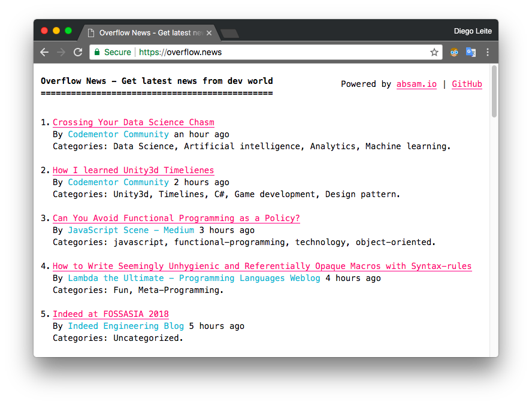

[](https://app.wercker.com/project/byKey/75e452018a5c4de409be0b20c72de16a) [](https://coveralls.io/github/devfsa/overflow-news?branch=nunes%2Fadding_coverage)

# Overflow News
:books: Don't waste time searching for good dev blog posts. Get the latest news here.

## Screenshot


## Requirements
* [Docker](https://www.docker.com/)
* [Docker Compose](https://docs.docker.com/compose/)
* [Pino](http://getpino.io)

## How to configure?
Create the `.env` file, containing the environment variables, and the fill the missing values:
```
cp .env.example .env
```

## How to run?
Run this command below and open the following URL in the browser: http://localhost:8080
```
$ docker-compose up --build
```

## Prettify log messages
Below `overflow-news_worker_1` is a container name example.
```
$ docker logs -f overflow-news_worker_1 | pino -l
```

## How to deploy?
```
$ docker-compose -f docker-compose.prod.yml up --build
```
